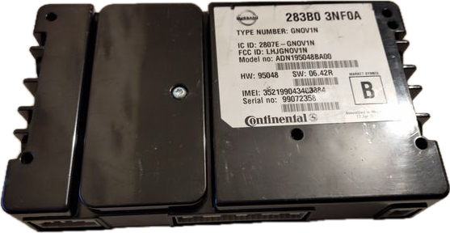
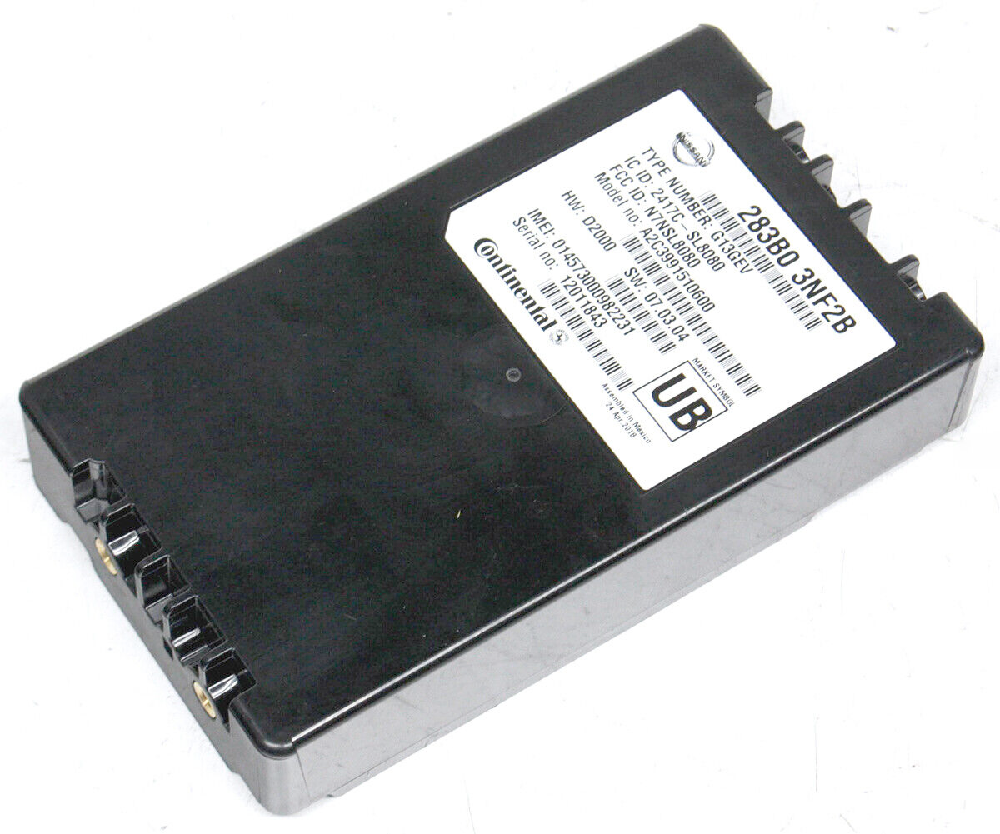

## Nissan LEAF TCU

Nissan LEAF comes from factory with TCU (Telematic Contol Unit) for remote command functions and CARWINGS functionality in navi unit.
TCU can be located behind the glovebox on LHD-cars, and somewhere in footwell for RHD-cars. Plenty of info on forums.

### TCU 2G

Continental-manufactured TCU unit based on Continental NOVANTO-telematics platform. 

#### Hardware
- Freescale MC9S12XEQ512VAL for CAN communication
- Infineon/DWD PMB8876 for baseband and program processor
- FCCID: [LHJGNOV1N](https://fcc.report/FCC-ID/LHJGNOV1N)

#### Software
- Runs Nucleus RTOS
- Firmware configuration file mentions GM VLBS/OnStar
- Incorporates NOVANTO Stolen Vehicle Tracking software, works via SMS commands (not analyzed yet)
- Firmware binary mentions FOTA, Firmware OTA-updates?
- EV App handles remote commands with server written with canbus and stored in flash

### TCU 3G

In the US (maybe in EU too, not sure) some LEAFs were retrofitted to 3G or after 2015/16 came with 3G from factory.
