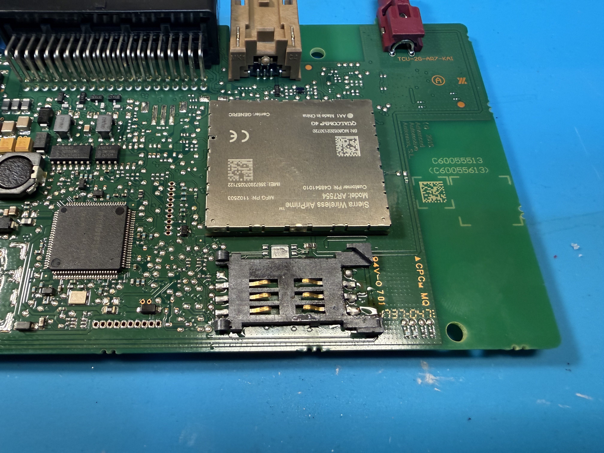
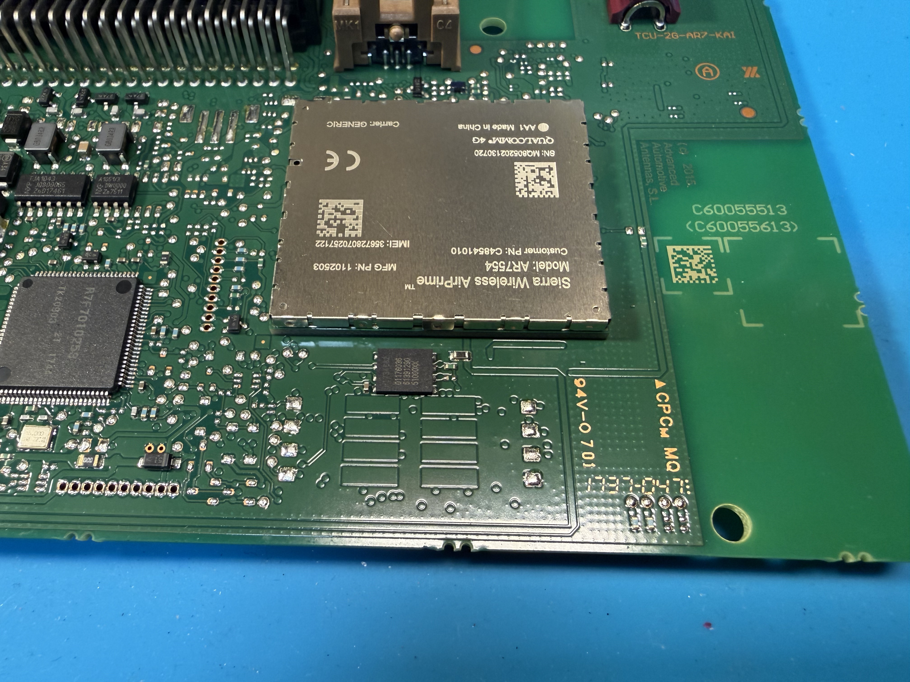
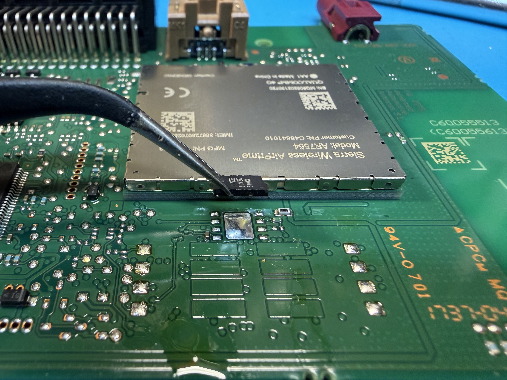
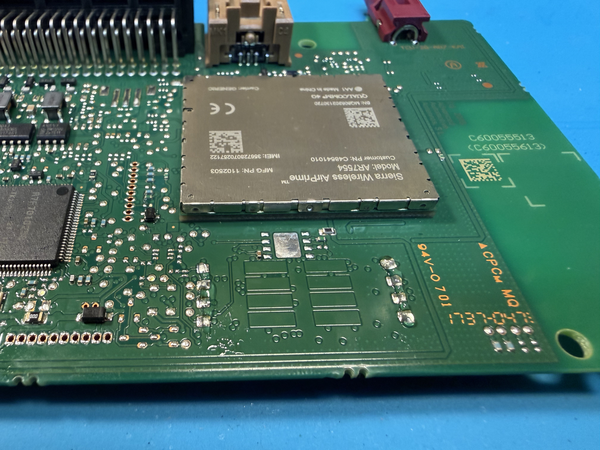
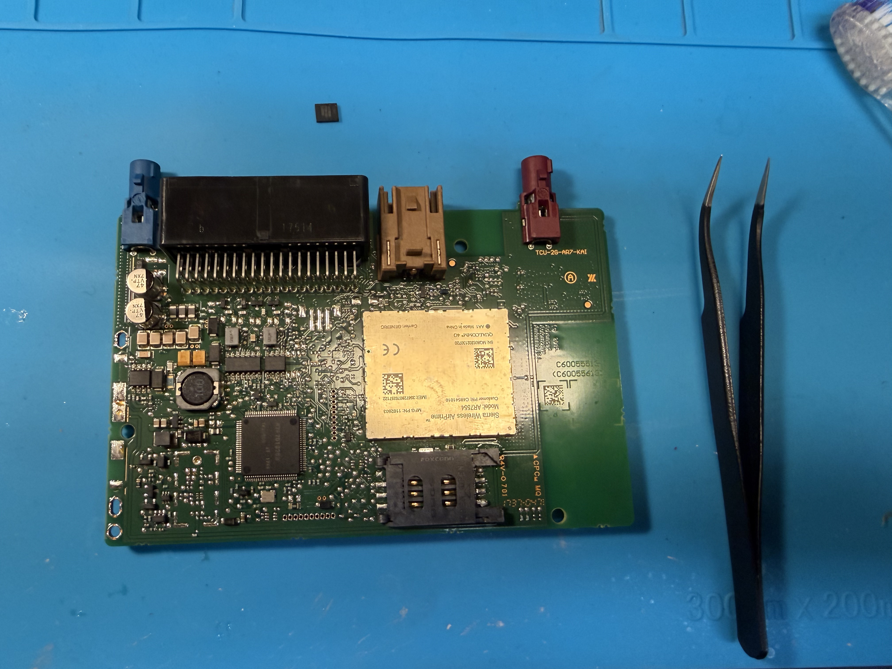

# Soldering the SIM Slot
  

TCUs from 2017 and afterward do not come with a sim slot installed, however they still have the pads on the PCB. Buying a SIM slot from any electronics store and soldering on will make it possible to use any sim of your choice.

Few links:
- https://ro.mouser.com/ProductDetail/Amphenol-MCP/C707-10M006-049-2A
- https://www.tme.eu/en/details/sim5060-6-0-26-00a/card-connectors/gct/sim5060-6-0-26-00-a/

## Step 1: Remove old eUICC SIM

Using a microsoldering station / heat gun, remove the old eUICC. Be careful to not accidentally unsolder nearby components.
Use temperature around 420-450 Celsius to quickly and effectively remove the slot.

## Step 2: Solder new SIM slot

Solder on new SIM slot by applying some flux on the contacts if available, and soldering the slot in orientation shown on the image (4G version). For 3G, the orientation is different.
Remember to clean the flux after soldering with isopropyl alcohol for example.

*BE CAREFUL!*   The slot may not lay flat on the PCB (which is okay), there may be small components like resistors under the slot. They are small enough to not interfere too much with the slot, but are easy to accidentally knock off the board and cause issues with the SIM.

## Step 3: Confirm operation

When done, you can easily test to see if the SIM card is working. Plug the SIM card back to the car and monitor the car icon on the navigation system:
. If the car is crossed, the TCU is not getting cell reception possibly due to: poor signal, SIM card registration issue or SIM card not detected.

The SIM ID (ICCID) will not update to the navi unit (NissanConnect settings, ID Information screen), don't panic :)

