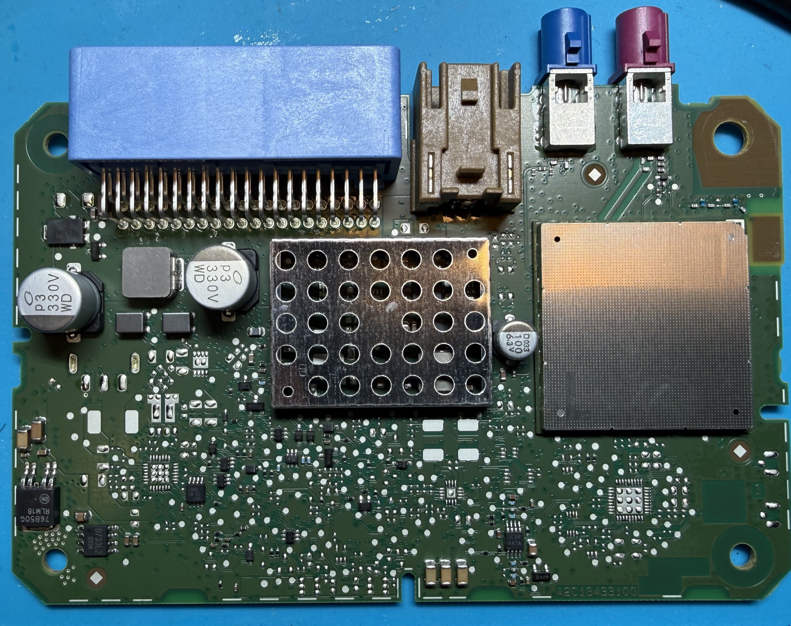
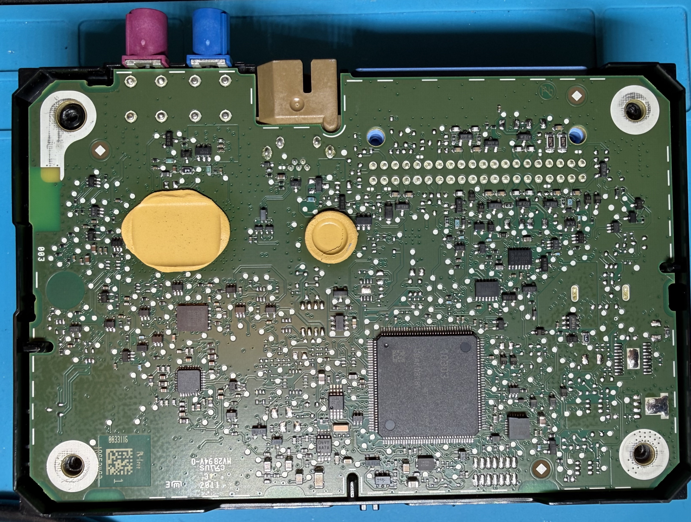
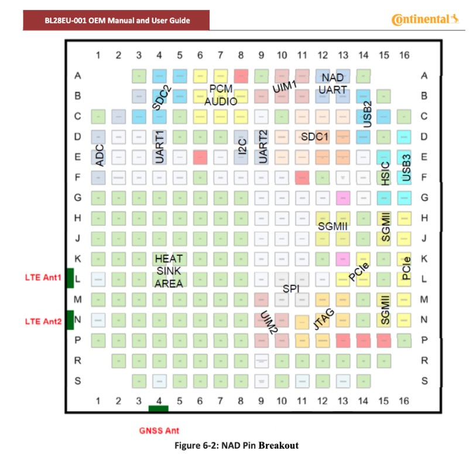
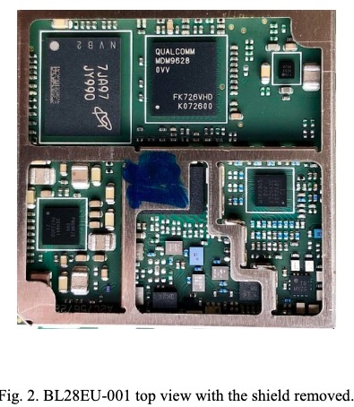

# GEN3 TCU: Continental AIVC2

GEN 3 TCU runs on BL28EU001 platform, which is the main "processor". Main SOC is Qualcomm MDM platform.
Runs Linux, with a VUC (CAN Controller).

More info on the BL28EU001 from FCCID: [https://fccid.io/LHJ-BL28EU001](https://fccid.io/LHJ-BL28EU001)

## PCB

## VuC (CAN Controller)
Renesas V850 Platform

## More on the SOC Package

